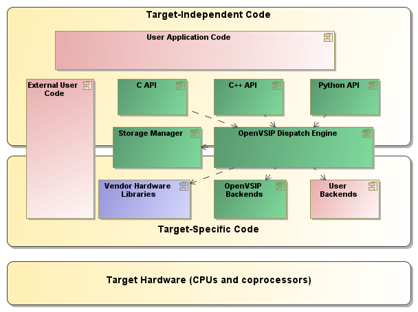

Architecture
============

High-level overview
-------------------

OpenVSIP provides a portable High-Performance Computing platform that is 
able to take advantage of many platform-specific optimizations.

Dispatch Engine
---------------

OpenVSIP provides sophisticated logic to map high-level operations to a wide range of
platform-specific implementations. The underlying dispatch mechanism uses a combination of compile-time (template meta-programming) as well as runtime techniques to establish the best way to perform an operation. Thus which execution kernel is chosen may depend on the argument types, the problem size, as well as the current location of the data (host or device memory).
The dispatch engine has been designed to be highly extensible, to allow easily to add new backends non-intrusively.

Storage Manager
---------------

While conventional applications use "normal" heap memory to store their data, HPC applications typically make use of specialized storage associated with computing devices such as GPUs. OpenVSIP's storage manager allows the application to manage replica of its data in different address spaces, to minimize the data movement needed throughout its operation.

Object Model
------------

OpenVSIP represents data in terms of vectors, matrices, and tensors, and defines functions to operate on them, including elementwise functions, linear algebra operations, signal transformations such as FFTs or convolutions or other filters.

Interfacing with those data on such a coarse-grained level makes it convenient to write high-level algorithm-centric code, and provides a lot of latitude to implementation to apply hardware-specific optimization (including vectorization, task offloading to GPUs and other accelerators, multi-core parallelizations, etc.)

The underlying block objects distinguish between logical and physical layout, making it possible to fine-tune the physical data layout to improve performance, while at the same time keeping the logical layout and with it the algorithmic structure of the code unchanged.

Language Bindings
-----------------

At this time OpenVSIP provides APIs in C++ and in Python (though a couple of additional languages are planned). This not only allows independent C++ and Python programs to be written using OpenVSIP, it also supports a continuous workflow starting with scripted prototypes in Python, a seamless transition to C++, and even a combination of the two (using a shared runtime to pass objects across language boundaries without data copies !), making it possible to verify C++ implementations with their scripted prototypes.

The C++ API is fully compliant with the [VSIPL++ standard](http://www.omg.org/spec/VSIPL++/).